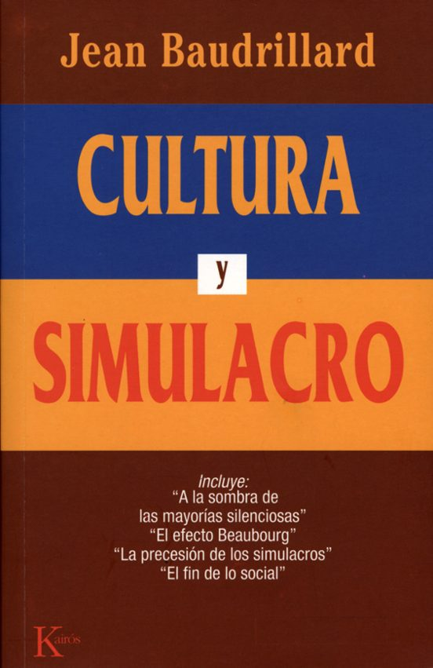

"¿Tiene cuerpo Madonna? [...] tengo la impresión de que todos estos signos hipersexuales se exacerban precisamente porque ya no se dirigen a nadie, que encuentran una especie de autorreferencia, así, tetánica, hiperbólica, y que ya no hay en el universo de Madonna, en esta especie de esfera que consigue producir, **ya no hay ningún otro, ya no hay ninguna alteridad real**". – Jean Baudrillard

Baudrillard diagnostica un reino absoluto del simulacro, desarmado de todo referente, sin la sombra de un afuera que interrumpa su régimen exclusivo. Todo culmina con la afirmación de que el mundo ha sido golpeado por la **desrealización absoluta,** en el advenimiento exclusivo de un simulacro libre.

Pero, ¿y si nuestros mercados financieros fueran iguales y la abstracción hubiera sustituido a la realidad? 

Sería el reino del Simulacro.

El Mundo dominado por las necesidades de reproducción del sistema capitalista ha saltado por los aires, definitivamente. Habita en el Imaginario y ya no sabe que existe el Mundo Real.

> "En este Imperio, el Arte de la Cartografía alcanzó tal perfección que el mapa de una sola Provincia ocupaba toda una Ciudad, y el mapa del Imperio, toda una Provincia.
> 
> Con el tiempo, estos mapas inaceptables dejaron de ser satisfactorios y los gremios de cartógrafos crearon un mapa del Imperio que tenía el mismo tamaño que éste y que coincidía punto por punto con él.
> 
> Las generaciones posteriores, que no eran tan aficionadas al estudio de la cartografía como sus antepasados, vieron que este vasto mapa era inútil, y no sin cierta crueldad, lo abandonaron a las inclemencias del sol y de los inviernos.
>
> En los desiertos de Occidente aún quedan jirones de este mapa, habitados por animales y mendigos; en todo el país no hay otra reliquia de las disciplinas geográficas".
>
> Suárez Miranda, [_Viajes de varones prudentes_](http://www.sccs.swarthmore.edu/users/08/bblonder/phys120/docs/borges.pdf?ref=tftc.io) (El Mapa)

El cuento *"La exactitud de la ciencia"* de Jorge Luis Borges (a menudo conocido como *"El mapa"*) es una estimulante fábula que explora el concepto filosófico de representación y los límites del conocimiento y la comprensión humanos.

El relato presenta un mundo ficticio en el que unos dirigentes deciden crear un mapa que represente perfectamente su territorio, hasta el más mínimo detalle. En su búsqueda de precisión y exactitud, producen **un mapa inmenso e increíblemente detallado que cubre perfectamente todo el territorio.** Sin embargo, este colosal mapa se vuelve tan difícil de manejar que es abandonado y cae en el abandono, **mientras que el territorio real que representa se vuelve oscuro y descuidado**.

Las personas que vienen al mundo después de generaciones olvidan que el mundo real existe y pronto creen que el mapa es la tierra. 

La abstracción se convierte en su realidad.

El mapa es una alegoría que invita a la reflexión y **nos recuerda que, aunque las representaciones son valiosas y necesarias para comprender nuestro mundo, nunca deben sustituir por completo la riqueza y complejidad de la realidad que pretenden representar.**

Lo siento por los investigadores fundamentalistas honestos como Hussman y otros; no sé si podría vivir con este enésimo asalto a la Razón y la ciencia por parte de la Imaginación. Estamos siendo literalmente aniquilados por lo imaginario.

La gente que todavía piensa un poco se consuela diciendo que después de la lluvia viene el sol, y más tarde llegará la reconciliación entre lo imaginario y lo real.

Yo no estoy en ese bando; por supuesto que diagnostico que el imaginario actual se hundirá, ésa es la necesidad lógica, pero no a través de la reconciliación y el choque con lo real. He llegado a creer que lo imaginario no se encontrará/ya no se encontrará con lo real, sino que se estrellará contra un imaginario, contra una locura superior, de orden superior, aún más invasiva.

Ya lo veremos.

Si quieres entender, lee a Baudrillard. Prefiero a Marx, Althusser, o Clouscard, pero me veo obligado a reconocer el poder explicativo del pensamiento de Baudrillard. "Tamiza la sociedad de consumo, las ideologías, los mitos, las modas y las técnicas, y analiza la lógica de los objetos **en términos de su inscripción en un sistema de signos**. **Todo ello culmina en una desrealización absoluta del mundo, en el advenimiento exclusivo de una simulación libre. Baudrillard plantea la ausencia de un más allá del simulacro"** (Véronique Bergen, [Lignes 2010/1, N° 31](https://www.cairn.info/revue-lignes-2010-1-page-37.htm)). Baudrillard es escalofriante.

#### Estos son los principales títulos de la prensa financiera de noviembre de 2023:

- Comienza el mayor repunte de la renta fija desde los años 80.
- El S&P 500 registra una de sus mejores subidas de noviembre en un siglo.
- Los bonos nunca habían subido tanto en un mes desde Volcker. 
- Los bonos hicieron de noviembre un mes para recordar batiendo récords
- Noviembre fue un mes único para los activos. 
- Los vendedores en corto registraron pérdidas de 80.000 millones de dólares, ya que la subida de noviembre acabó con las apuestas. 
- Los bonos del Tesoro registran en noviembre su mayor subida desde 2008. 
- La renta variable mundial se dispara en noviembre al volver el apetito por el riesgo.
- Los inversionistas inundan los fondos con bonos no deseados, generando una entrada mensual récord.
- Los activos de los mercados emergentes registran su mejor subida mensual desde el 23 de enero.
- El índice S&P500 ganó un 9,13% en noviembre, mientras que el Nasdaq100 ganó un 10,82%. 
- El índice KBW Bank ganó un 15,45%.
- Semiconductores 15,95
- El índice búrsatil NYSE ganó un 11,37%,
- El índice Russell 2000 de pequeña capitalización ganó un 9,03%,
- El índice aritmético Value Line de empresas de mediana capitalización ganó un 8,88%.
- El índice S&P400 Midcaps ganó un 8,50%.
- El índice Dow Transportation ganó un 8,36%. 
- El índice Goldman Sachs Short subió un 11,4%.
- El índice NYSE Arca Gold Bugs (HUI) subió un 11,20% en noviembre.
- La plata subió 2,43 dólares, un 10,6%, hasta 25,27 dólares.
- Los rendimientos del Tesoro a diez años cayeron 60 puntos básicos, la mayor caída mensual desde diciembre de 2008 (71 puntos básicos). 
- Los rendimientos de los MBS de referencia se desplomaron 81 puntos básicos, también la mayor caída desde diciembre de 2008 (94 puntos básicos). 
- Los rendimientos a dos años cayeron 41 puntos básicos. 
- Los precios de los CDS de grado de inversión cayeron 17 puntos básicos (la mayor caída mensual desde octubre de 2022) hasta su nivel más bajo desde enero de 2022.
- Los CDS de alto rendimiento cayeron 122 puntos básicos, hasta 402 puntos básicos, cotizando a su nivel más bajo desde abril de 2022.
- Los CDS de JPMorgan cerraron el mes con una caída de 18 puntos básicos desde el precio más bajo (52 puntos básicos) desde enero de 2022.
- Los diferenciales entre los bonos con grado de inversión y los bonos del Tesoro se estrecharon 25 puntos básicos, hasta un mínimo de 22 meses de 1,04 puntos porcentuales. 
- Los diferenciales de alto rendimiento se estrecharon 67 puntos básicos, hasta 3,70. 
- Los precios de los CDS son más bajos y los diferenciales son más estrechos hoy que al comienzo del ciclo de "endurecimiento" de la Reserva Federal.
- La tendencia continuó el primer día de negociación de diciembre: "El rendimiento a dos años de EE.UU. cae 10 puntos básicos por Powell". El índice Goldman Sachs Short subió un 6,2% el viernes, mientras que el Russell 2000 small caps subió un 3,0%.
- Las expectativas del mercado para el tipo de los fondos federales en la reunión de enero de 2025 se desplomaron 52 puntos básicos esta semana, hasta el 3,84% (95 puntos básicos menos que el máximo del 18 de octubre). 

**28 de noviembre - Associated Press:**

Un funcionario clave de la Reserva Federal planteó el martes la posibilidad de que la Fed podría decidir recortar su tasa de interés de referencia **tan pronto como esta primavera** si la inflación sigue cayendo de manera constante. *"Si la inflación sigue calmándose durante varios meses más – no sé cuánto tiempo podría ser – tres meses, cuatro meses, cinco meses – y estamos convencidos de que la inflación está realmente bajando y en el buen camino, entonces podría empezar a bajarla. la tasa de política simplemente porque la inflación es más baja"*, dijo Waller.