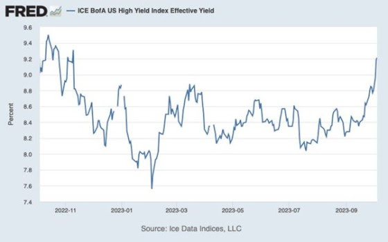

La financiarización es una ingeniería basada en el endeudamiento para reducir los costes de los préstamos, bajar el coste del capital, hacer rentables inversiones que de otro modo no lo serían, permitir a los gobiernos endeudarse más y, en última instancia, lograr un crecimiento económico que no sería posible sin ingeniería.

Esta fue una elección más o menos consciente realizada a finales de la década de 1970 y luego acelerada en la década de 1980 con la larga caída de los tipos de interés posterior a Volcker.

La financiarización se basa en la producción de deuda y en el uso cada vez más intensivo del apalancamiento. Por ejemplo, me han dicho que algunas estrategias aplicadas a los fondos del gobierno estadounidense están actualmente apalancadas ¡entre 50 y 100 veces!

Las recientes declaraciones de Ken Griffin, de Citadel, corroboran esta opinión. Por cierto, ¡el antiguo jefe de la Fed, Ben Bernanke, se ha reciclado en Citadel!

Desde Greenspan existe una compensación sistémica: se autoriza un apalancamiento cada vez más demencial para mantener bajos los costes de los préstamos y las posibilidades de endeudamiento del Tesoro estadounidense.

Al hacerlo, los bajos costes se intercambian por seguridad, y los mercados codiciosos prefieren sacrificar la seguridad para reducir los costes y, por tanto, registrar diferenciales y comisiones.

El sesgo hacia la asunción de riesgos es tanto mayor cuanto que sabemos que la Fed está ahí para salvar a los incautos.


Este es el sistema actual, y no hemos salido de él a pesar de la supuesta lucha contra la inflación; al contrario, para bajar los costes a largo plazo, utilizamos el apalancamiento y, por tanto, asumimos riesgos, pero la Fed asegura estos riesgos y paga por ellos. Este sistema funciona externalizando los riesgos del mercado. Lo vimos con SVB, por ejemplo.


*"Los fondos de cobertura y otros que utilizan esta estrategia ayudan a proporcionar liquidez y financiar el mercado del Tesoro de manera eficiente, reduciendo los costes para los contribuyentes... ahorramos decenas de puntos básicos en el coste para el contribuyente de EE.UU., que asciende a miles de millones de dólares" al año al permitir que exista este comercio"*, dijo Griffin.

Todas las crisis financieras tienen su origen en el apalancamiento, es decir, en un endeudamiento y una asunción de riesgos excesivos.


Ken Griffin habla en serio. La especulación apalancada reduce el coste de la deuda y el capital, pero supone una amenaza clara e inmediata para la estabilidad del sistema. 


Así ha sido durante años.

El apalancamiento y los derivados han desempeñado un papel clave en muchos de los colapsos de los mercados de divisas y bonos de los mercados emergentes. La explosión de la deuda de LTCM llevó a los mercados mundiales de deuda al borde del abismo en 1998. La reducción del riesgo y el desapalancamiento estuvieron a punto de desencadenar un colapso mundial en 2008. El apalancamiento especulativo en el mercado de bonos desempeñó un papel clave en la crisis de la deuda europea de 2011/2012. Se necesitaron miles de millones de QE en 2020 durante la Covid. Más recientemente, el apalancamiento del mercado estuvo en el epicentro de la crisis de los gilts británicos el pasado otoño.


Este régimen de apalancamiento se ha vuelto vulnerable desde los últimos acontecimientos relacionados con la lucha contra la subida de precios, la escasez, la desglobalización, el conflicto ucraniano, el conflicto en Oriente Medio, la fragilidad del mercado del petróleo y el desafío al papel hegemónico del dólar.


**Se ha vuelto vulnerable, pero paradójicamente también se ha vuelto más necesaria que nunca**, porque sin ella el sistema basado en la deuda del Tesoro estadounidense implosionaría. Es necesario mantener bajo control los tipos de interés a largo plazo y no permitir que suban por encima del 5%; y lo que es más, este nivel no puede mantenerse durante demasiado tiempo.

Desde la oleada inflacionista mundial de 2021, los tipos de interés de la deuda, sobre todo la denominada en dólares, han subido bruscamente y la carga del "servicio" de esa deuda se ha disparado.

**El sobreendeudamiento no sólo aumenta en el llamado Sur. En los países del Norte, el sector capitalista y los gobiernos se enfrentan a niveles crecientes de deuda y a costes de financiación cada vez más elevados.**

Los altos tipos de interés ya están empezando a perjudicar a las empresas estadounidenses, en una economía que va mejor que cualquier otra gran economía capitalista avanzada. 

**Charles Schwab** estima que los costes de endeudamiento de algunas empresas se han duplicado o casi triplicado en 2023 en comparación con años anteriores, lo que supone una pesada carga para los balances corporativos. 

Los rendimientos efectivos de la deuda corporativa sin grado de inversión (deuda en manos de las empresas más débiles) subieron al 9% este mes, **según el índice ICE BofA US High Yield**. 

**Los gastos por intereses de las empresas estadounidenses aumentaron un 22% en el primer trimestre de 2023 con respecto al año anterior.**

Como resultado, según S&P Global, 459 empresas se declararon en quiebra a finales de agosto, superando el número total de quiebras registradas en 2021 y 2022.


Según Deutsche Bank, [los impagos totales de los préstamos estadounidenses podrían alcanzar el 11,3% de la deuda pendiente](https://markets.businessinsider.com/news/bonds/credit-crunch-recession-debt-default-bank-failures-interest-rates-lending-2023-5?utm_medium=ingest&utm_source=markets), sólo ligeramente por debajo del nivel récord del 12% registrado durante la Gran Recesión.


**Lo preocupante es que la subida de tipos empezará a notarse a partir de 2025, cuando se refinancien grandes cantidades de deuda pendiente. **

El gráfico siguiente muestra el perfil de vencimiento de **la deuda del Russell 2000 (las 2000 mayores empresas de EE.UU.)**. A medida que estas empresas empiecen a refinanciar sus deudas a tipos mucho más altos, los impagos se multiplicarán.

La situación será peor para las denominadas empresas "zombis", es decir, aquellas que no obtienen beneficios suficientes para reembolsar su deuda, por lo que sólo pueden sobrevivir endeudándose aún más.

[Los economistas del BPI también han identificado una nueva categoría de empresas vulnerables en las principales economías, a las que han denominado "ángeles caídos"](https://thenextrecession.wordpress.com/2022/03/06/fallen-angels/). 

Se trata de empresas a punto de perder su calificación crediticia de grado de inversión porque han acumulado más deuda de la que pueden gestionar. Por tanto, son vulnerables a una "rebaja" de su calificación crediticia, lo que aumentaría significativamente el coste del servicio de su deuda. 

**Goldman Sachs** calcula que el 13% de las empresas que cotizan en bolsa en EE.UU. "podrían considerarse" zombis. La Reserva Federal encontró que solo alrededor del 10% de las empresas públicas eran zombis en 2019, utilizando criterios ligeramente diferentes. 

Alternativamente, **Deutsche Bank** encontró que más del 25% de las empresas estadounidenses eran zombis en 2020, frente al 6% en 2000. Un estudio reciente de **Kearney** de 4,5 millones de registros de empresas de alrededor de 70.000 empresas cotizadas en 154 sectores y 152 países encontró que el número de empresas zombis ha aumentado en un 10% desde 2021 a casi 2.000.

Si aumentan los impagos de las empresas, se volverá a presionar a los acreedores, es decir, a los bancos.  

La crisis de los bancos regionales del pasado marzo fue un paseo, pero provocó la quiebra de varios bancos pequeños y el resto fueron rescatados con más de 300.000 millones de dólares en financiación de emergencia de organismos gubernamentales. 

Y luego está el Shadow y el llamado ¡Crédito Privado! Las instituciones no bancarias prestaron sumas considerables para inversiones más o menos especulativas.

El sector público también. El gobierno estadounidense ha gastado 659.000 millones de dólares en lo que va de año para pagar los intereses de su deuda. Es este aumento del coste de la deuda y el elevado tipo de interés de los bonos del Estado lo que ha llevado a los inversores bursátiles estadounidenses a empezar a vender. ¡Las pérdidas de los fondos invertidos en bonos son considerables! ¡Pueden alcanzar el 40% del capital! Sin precedentes.

Gita Gopinath, Subdirectora Gerente del FMI, expresaba su preocupación en [un reciente artículo publicado en el FT](https://www.ft.com/content/26f17a3f-2f64-45df-aff2-d0476dd53d42).

Gopinath: *"Con niveles récord de deuda, mayores cuando se amplían los tipos de interés, y las perspectivas de crecimiento en su punto más bajo desde hace dos décadas, la moderación está a la orden del día, **incluso para los emisores de divisas de reserva**.
De hecho, EE.UU. tiene uno de los mayores déficits, del 8% del PIB este año y se espera que alcance una media del 7% en los próximos años. A estos tipos, los pagos netos de intereses del gobierno estadounidense pasarían del 8% de los ingresos (486.000 millones de dólares) en 2019 al 12% (1.270 millones de dólares) en 2028. Dado el papel central de EE.UU. en las condiciones de financiación mundial, una posición fiscal ordenada es crucial, tanto para EE.UU. como para otros países afectados por la subida de tipos y la debilidad de las divisas."*

Esto significa que hay que sacrificar el desarrollo productivo en favor del rigor fiscal y monetario. **Para Gopinath, *"poner en orden las finanzas públicas es esencial para que los gobiernos puedan responder a las expectativas de sus ciudadanos"***.

La austeridad es imposible en estos tiempos de competencia estratégica, de rearme, de malestar social, de necesidades colectivas crecientes y de transición climática, así que será la implosión: **el free lunch de la deuda tendrá que continuar, y retomarse tras una pausa simbólica, no hay alternativa, es marchar... hacia el precipicio o morir**.