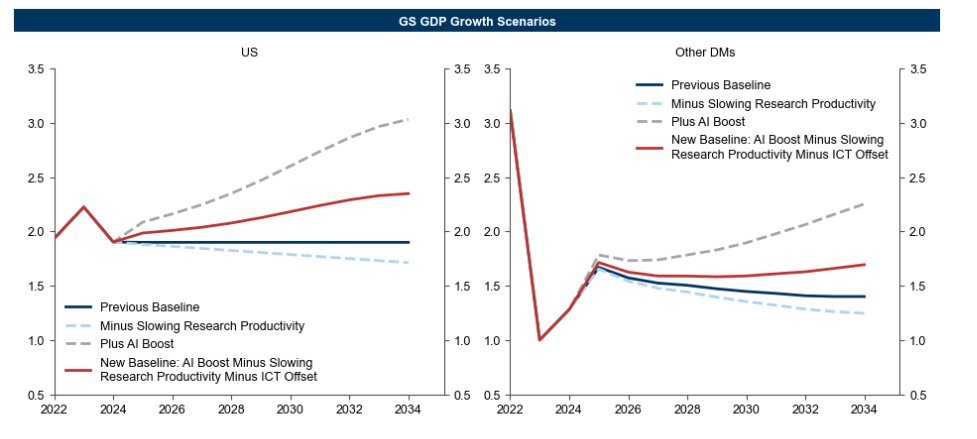

En Estados Unidos, la connivencia patriótica es total. Trasciende las líneas partidistas y las divisiones entre grupos sociales. Es como si los estadounidenses hubieran comprendido implícita e inconfesadamente que les interesa permanecer unidos para explotar mejor el mundo exterior. El imaginario del sistema está tan construido que oculta las fuentes objetivas de la prosperidad estadounidense -la deuda, el saqueo del ahorro mundial, el intercambio desigual, la dominación jurisdiccional, el régimen comprador, etc.- pero las sustituye por un sentimiento ampliamente compartido de excepcionalismo y superioridad que, en última instancia, lo justifica todo, y sobre todo la buena vida del consumidor.

La connivencia, pues, atraviesa todas las líneas divisorias. Lo vemos, por supuesto, en la política exterior, en los medios de comunicación, pero también en la banca y las finanzas, lo que sorprende a primera vista, porque en este sector nos regimos más por el afán de lucro que por el interés patriótico.

Sin embargo, todo tiene sentido si recordamos el adagio que rige las finanzas americanas desde 1987: "don't fight the Fed"; la regla de oro es no oponerse a la Fed, no ser canalla como se suele decir, sino al contrario, favorecer la transmisión de su política. Si respetamos esta regla, que consiste en que el sector financiero americano está para transmitir los impulsos de la Fed y que si no lo hace es castigado, entonces lo entendemos todo. El sector financiero y bancario, en su proximidad accesoria a los gnomos, les hace el juego e incluso va más allá, anticipándose a sus deseos... aunque no se formulen... para eso están las cenas en el pueblo y los puentes laborales....

La connivencia entre la Fed y su 'socio' Goldman Sachs es ejemplar, simbiótica.

El endurecimiento de la política monetaria tiene por objeto descremar selectiva y parcialmente el sistema estadounidense, con el fin de concentrar aún más capital en torno a los TBTF y aniquilar a los marginales.

**Greenspan lo dejó claro en su día.** Sobre todo tras su marcha. A menudo me he hecho eco de ello, y soy casi el único que conozco que lo haya hecho. Es cierto que presté mucha atención a todas las declaraciones no oficiales que se hicieron tras la crisis de 2008 porque consideré que expresaban verdades valiosas aunque no fueran políticamente correctas.

La culpa de los bancos en 2006", dijo, "fue que no descargaron, repartieron y diseminaron sus riesgos entre los más pequeños. Fueron demasiado codiciosos y mantuvieron el riesgo en sus libros para ganar más".

Esta situación, lamentó Greenspan, significó que en la crisis los grandes actores, los TBTF, también fueron destruidos. Esperaba que esto no volviera a ocurrir en el futuro.

La limpieza de la podredumbre debe ser limitada y selectiva para que no se convierta en sistémica; no debe poner en peligro el sistema, su arquitectura y sus pilares.


La limpieza de la podredumbre debe ser limitada y selectiva para que no se convierta en sistémica; no debe poner en peligro el sistema, su arquitectura y sus pilares.


**Este es el primer punto estratégico:** la lección de Greenspan ha sido escuchada. El endurecimiento monetario no metió en problemas a ningún gran banco. Habían vendido su riesgo de tipos de interés y lo habían repartido.


**El segundo punto estratégico** es que el capital del resto del mundo necesita permanecer en Estados Unidos para financiar los déficits, comprar bonos del Tesoro y mantener el juego. En resumen, el capital del resto del mundo debe seguir financiando la excelencia y el excepcionalismo estadounidenses. El resto del mundo debe financiar su propia servidumbre.


Como dijo Bernanke cuando el capital abandonó EE.UU. y el dólar se desplomó: *"No importa después de la crisis, el capital volverá a EE.UU. porque es donde encontrará la mayor rentabilidad y seguridad"*.


Así que la otra parte es mantener el atractivo del mercado financiero estadounidense creando constantemente nuevas modas financieras, nuevos caramelos, nuevos esquemas Ponzi. La segunda parte consiste en mantener el espíritu de juego que tanto favorece a Estados Unidos.


**Los activos financieros estadounidenses deben seguir siendo siempre imanes.** Estos imanes son más o menos reales y aportan verdaderas innovaciones, pero otros lo hacen igual de bien, aunque sean dudosos.

Y en estos momentos históricos, los viejos imanes, los grandes nombres de la tecnología y de la innovación americanas, deben ser reactivados. Están al final del ciclo y espontáneamente dejarían de poder desempeñar este papel de imán, dejarían de atraer capitales y de mantener los flujos a favor de Estados Unidos.

Obsérvese que estos flujos siempre repercuten en los sectores tradicionales, porque la existencia de estos flujos hace bajar los tipos de interés medios a largo plazo, lo que ayuda a los sectores de "value" y ayuda al Tesoro estadounidense con su financiación. El llamado **efecto cartera** significa que la sobrevaloración de determinados sectores reduce gradualmente el coste del capital y el acceso a la financiación de otros sectores.

**Nota:** Por cierto, este es el principio del QE: sobrevaloramos los bonos del Estado para que esta sobrevaloración se transmita a todos los demás activos financieros por arbitraje de proximidad.


Este era el objetivo de la Operación IA, la operación de Inteligencia Artificial, ¡que se montó desde cero con una gran coordinación! **La IA es una operación de promoción, con la creación de un concepto, una imagen y un mito.** Lo que hay detrás de la IA ya existía antes, estábamos en lo progresivo, en lo continuo, pero la genialidad era hacer creer que había una ruptura, una invención y crear una discontinuidad. Si miras las portadas de las revistas con este ojo, verás que he dado en el clavo.


Permítanme ser más preciso:

Lo que estoy describiendo es lo que está ocurriendo: los TBTF no están sufriendo, lo que está sufriendo son las masas y las pequeñas y medianas entidades, miren el Russell 2000.

Teniendo esto en cuenta, la destrucción debe ser selectiva y debe aumentar la concentración en torno a los TBTF financieros y bancarios, por un lado, y a las empresas tecnológicas punteras, por otro.

Este es el objetivo del impulso a la IA: **tenemos que convertirla de nuevo en un área de excelencia para los EE.UU., lo que atraerá capital y hará bajar los tipos de interés a largo plazo, y al mismo tiempo nos dará una ventaja sobre competidores como China.** La operación de la IA es una profecía autocumplida; tiene una base innegable para la innovación, pero al convertirla en un producto estrella del mercado de valores estamos atrayendo capital, reduciendo el coste del capital y convirtiéndola en un fenómeno aún más generalizado y con mayor rapidez.


Estados Unidos sabe que la financiación prácticamente gratuita y el acceso a capital propio que no cuesta nada son la clave de su dominación, y gente como Goldman Sachs, que está *"haciendo la obra de Dios"*, contribuye a esta operación.


Resumiendo;
- EEUU necesita dominar y mantener el orden mundial
- Al mismo tiempo, los EE.UU. necesita limpiar su acto.
- EEUU está haciendo subir los tipos de interés, desmoronando la economía y acabando con los débiles
- En el proceso, están fortaleciendo los cimientos de su dominación
- EEUU necesita impulsar su excelencia tecnológica
- Necesitan seguir drenando capitales del resto del mundo para financiar sus déficits, mantener su excelencia y, por extensión, mantener la hegemonía del dólar.

El sistema estadounidense tiene una ventaja considerable sobre el resto del mundo: es el íntimo conocimiento que sus élites tienen del funcionamiento del sistema del capitalismo financiero. Conocen todos los entresijos, todas las particularidades, todos los mecanismos y, lo que es más, ¡son ellas las que fijan las reglas del juego y los criterios de valor!

Y por eso digo a menudo que la Fed está haciendo un gran trabajo de gestión: ¡son un grupo con talento!

Se manejan bien porque conocen bien el sistema, al haberlo diseñado ellos mismos, y lo conocen bien gracias a la interpenetración de la comunidad financiera, el gobierno y la Fed. **Se manejan bien porque todos son cómplices de desplumar al resto del mundo.**

El sistema capitalista es un sistema para acumular capital y pasta, y para ganar en este sistema hay que acumular más que los demás; y para acumular más que los demás, hay que conocer sus reglas y aceptarlas.


#### Citation

**Goldman Sachs:** "El enorme potencial económico de la IA generativa sugiere un potencial de crecimiento" "En las próximas semanas, aumentaremos nuestras previsiones de crecimiento para la segunda mitad de nuestro horizonte de previsión a 10 años como parte de nuestras perspectivas para 2024, incluso en 0.4 puntos porcentuales en EE.UU. y 0.2-0.4 puntos porcentuales en otros países desarrollados." (Fuente [Nick Timiraos](https://pic.twitter.com/2Ob5fnb9zO): Goldman está *haciendo el trabajo de Dios*, inflando la burbuja)

**Comentario:** Al inflar la burbuja de la IA, Goldman está ayudando a Powell. Powell quiere que el capital de ROW se quede e incluso venga a EEUU para mantener bajos los tipos de interés a largo plazo y altos los precios de los activos financieros para contrarrestar el efecto desestabilizador de la política monetaria.


