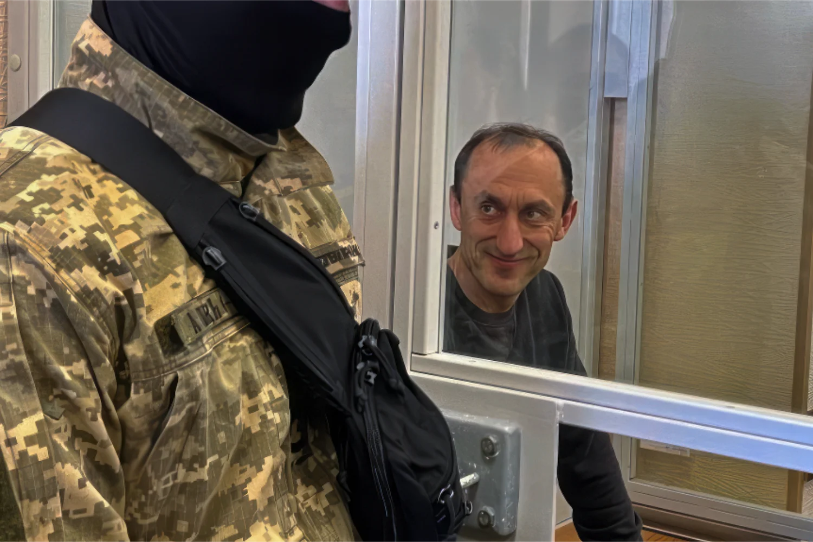

El Washington Post tiene [una nueva revelación bomba](https://www.washingtonpost.com/national-security/2023/11/11/nordstream-bombing-ukraine-chervinsky/): un oficial militar de alto rango conectado a los más altos niveles de la inteligencia ucraniana - que también pasa a estar en la cárcel por otros cargos - supuestamente jugó un papel clave en el sabotaje del gasoducto Nord Stream el año pasado.

Según "personas familiarizadas con la planificación", Roman Chervinsky, "un coronel condecorado de 48 años que sirvió en las fuerzas de operaciones especiales de Ucrania", fue el coordinador de la operación, pero no fue el "planificador". Chervinsky, "coronel condecorado de 48 años de edad que sirvió en las fuerzas de operaciones especiales de Ucrania", fue el coordinador de la operación, pero no el "planificador".

Chervinsky, a través de un abogado, ha negado esta historia y la califica de "propaganda rusa".

Los oleoductos estallaron el 26 de septiembre de 2022. Se han planteado varias teorías, pero Occidente señaló a los rusos como culpables desde el principio. Esto cambió cuando las investigaciones dejaron más claro que se trataba de un actor estatal, pero probablemente no Moscú. El veterano reportero Sy Hersh elaboró un extenso informe en febrero de 2023 en el que acusaba del sabotaje a un equipo secreto de submarinistas de la Marina estadounidense, con la autoridad de la administración Biden. Casi inmediatamente después, la corriente dominante occidental se centró en un equipo proucraniano "deshonesto" y, más recientemente, en la complicidad militar ucraniana.

El Washington Post se centra aquí en esta última teoría, utilizando en parte las filtraciones de Discord en primavera, que parecían mostrar que Estados Unidos estaba preocupado porque Ucrania había estado planeando un ataque de este tipo, como prueba de que Chervinsky podría haber ayudado a llevarlo a cabo finalmente. El documento plantea otras operaciones secretas dirigidas supuestamente por Chervinsky, entre ellas que también "planeó e implementó" operaciones para matar a líderes separatistas prorrusos en Ucrania y para "secuestrar a un testigo" en el derribo del vuelo 17 de Malaysia Airlines sobre la región oriental de Donbás en 2014.

Chervinsky cumple ahora condena por estar implicado en un complot que debía atraer a un piloto ruso para que desertara a Ucrania, pero que acabó en un ataque ruso contra las fuerzas ucranianas en el que murieron un soldado ucraniano y otras 17 personas. Chervinsky y otras personas afirman que la operación fue autorizada por el ejército. Según el WaPo (N. del T.: Washington Post):


> Chervinsky ha dicho que no fue responsable del ataque ruso y que, al intentar persuadir al piloto para que volara a Ucrania y entregara su avión, actuaba bajo órdenes. Califica su detención y procesamiento de represalia política por sus críticas al Presidente ucraniano Volodymyr Zelensky y a su administración. Chervinsky ha declarado públicamente que sospecha que Andriy Yermak, uno de los asesores más cercanos de Zelensky, espía para Rusia. También ha acusado al gobierno de Zelensky de no haber preparado suficientemente al país para la invasión rusa.


Ahora está siendo señalado por fuentes anónimas que el WaPo llama "personas familiarizadas con la operación". (Recordemos que **el informe condenatorio de Hersh del año pasado fue censurado por los principales medios de comunicación y los comentaristas por basarse en una fuente anónima**). Los funcionarios ucranianos no están haciendo comentarios sobre estas recientes revelaciones, que siguen manteniendo a Estados Unidos lejos de la mancha de la complicidad. Según el WaPo:


> En ocasiones, funcionarios estadounidenses han reprendido en privado a los servicios de inteligencia y a los militares ucranianos por lanzar ataques que corrían el riesgo de provocar una escalada de la guerra de Rusia contra Ucrania. Pero el malestar de Washington no siempre ha disuadido a Kiev.
> En junio de 2022, la agencia de inteligencia militar holandesa, la MIVD, obtuvo información de que Ucrania podría estar planeando atacar Nord Stream. Funcionarios de la CIA transmitieron a Zaluzhny a través de un intermediario que Estados Unidos se oponía a tal operación, según personas familiarizadas con esas conversaciones.


Obviamente, se plantearán preguntas sobre si se está utilizando a Chervinsky como chivo expiatorio o cabeza de turco y **sobre el momento en que estas fuentes anónimas aparecen de repente con información que se ha estado buscando durante más de un año en innumerables investigaciones oficiales y periodísticas**.

---


---

