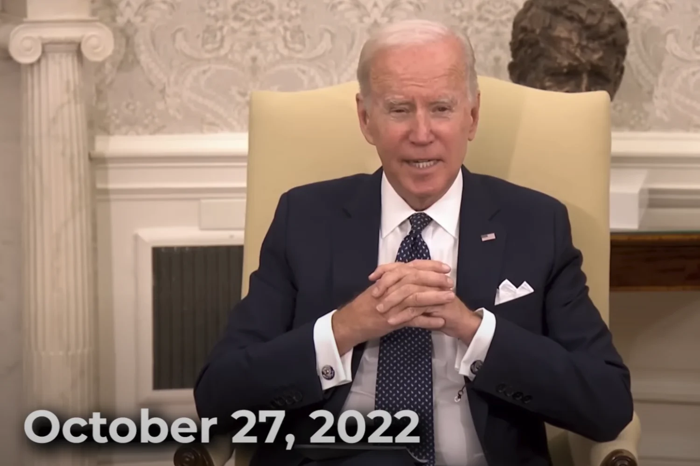



---

### Transcripción del video:

**BEN NORTON:** ¿Por qué Estados Unidos apoya tan firmemente a Israel?

En este vídeo de hoy voy a explicar las razones geopolíticas y económicas por las que Israel es una parte tan importante de la política exterior estadounidense y del intento de Washington de dominar no sólo la región de Oriente Próximo, sino realmente el mundo entero.

Para este análisis de hoy, he tenido el privilegio de contar con el economista Michael Hudson.Le traeré más tarde para que aporte más detalles sobre este tema.Pero antes, quiero destacar un contexto básico muy importante para entender esta relación.

Es crucial subrayar que Israel es una extensión del poder geopolítico de Estados Unidos en una de las regiones más importantes del mundo. 

De hecho, fue el actual presidente estadounidense Joe Biden, allá por 1986, cuando era senador, quien dijo célebremente que, si Israel no existiera, Estados Unidos [tendría que inventarlo](https://youtu.be/9AeAfFfTqMk?si=0910TwSfmR2hlNlx&t=61):



> Si miramos a Oriente Próximo, creo que ya es hora de que dejemos, los que apoyamos, como la mayoría de nosotros, a Israel en este organismo, de disculparnos por nuestro apoyo a Israel. No hay que pedir disculpas. Ninguna. Es la mejor inversión de 3.000 millones de dólares que hacemos. Si no existiera Israel, los Estados Unidos de América tendrían que inventarse un Israel para proteger sus intereses en la región; los Estados Unidos tendrían que salir a inventarse un Israel. Estoy con mis colegas de la Comisión de Relaciones Exteriores, y nos preocupamos largo y tendido por la OTAN; y nos preocupamos por el flanco oriental de la OTAN, Grecia y Turquía, y por lo importante que es. Palidecen en comparación... Palidecen en comparación con los beneficios que obtienen los Estados Unidos de América. **– Joe Biden**


**BEN NORTON:** En primer lugar, no hace falta decir que el llamado Oriente Medio, o un término mejor es Asia Occidental, tiene algunas de las mayores reservas mundiales de petróleo y gas, y toda la infraestructura económica en todo el mundo depende de los combustibles fósiles.

Estamos avanzando gradualmente hacia nuevas fuentes de energía, pero los combustibles fósiles siguen siendo absolutamente fundamentales para toda la economía mundial. Y el objetivo de Washington ha sido asegurarse de poder mantener unos precios estables en los mercados mundiales del petróleo y el gas.

Pero se trata de algo mucho más grande que el petróleo y el gas. La política declarada del ejército estadounidense desde la década de 1990, desde el final de la Guerra Fría y el derrocamiento de la Unión Soviética, es que Estados Unidos ha intentado mantener el control sobre todas las regiones del mundo.

Así lo declaró muy claramente el Consejo de Seguridad Nacional de Estados Unidos en 1992 en la llamada Doctrina Wolfowitz. El [Consejo de Seguridad Nacional de Estados Unidos escribió](https://www.archives.gov/files/declassification/iscap/pdf/2008-003-docs1-12.pdf):

El objetivo [de Estados Unidos] es impedir que cualquier potencia hostil domine una región crítica para nuestros intereses, y también reforzar así las barreras contra la reaparición de una amenaza global para los intereses de Estados Unidos y nuestros aliados. Estas regiones incluyen Europa, Asia Oriental, Oriente Medio/Golfo Pérsico y América Latina. El control consolidado y no democrático de los recursos de una región tan crítica podría generar una amenaza significativa para nuestra seguridad.

Entonces, en 2004, el gobierno estadounidense publicó su [Estrategia Militar Nacional](https://apps.dtic.mil/sti/tr/pdf/ADA431216.pdf), en la que Washington subrayaba que su objetivo era "el dominio de todo el espectro: la capacidad de controlar cualquier situación o derrotar a cualquier adversario en toda la gama de operaciones militares".

Ahora bien, históricamente, cuando se trataba de Oriente Medio, Estados Unidos se basaba en una estrategia denominada de "dos pilares". El pilar occidental era Arabia Saudí, y el oriental, Irán. Y hasta la revolución de 1979 en Irán, el país estaba gobernado por un dictador, un sha, el monarca, que contaba con el respaldo de Estados Unidos y servía a los intereses estadounidenses en la región.

Sin embargo, con la revolución de 1979, Estados Unidos perdió uno de los pilares de su estrategia de doble pilar, e Israel pasó a ser cada vez más importante para que Estados Unidos mantuviera el control sobre esta región crucialmente estratégica.

No se trata sólo de las enormes reservas de petróleo y gas de la región; no es sólo el hecho de que muchos de los principales productores de petróleo y gas del mundo estén situados en Asia Occidental. Es también el hecho de que algunas de las rutas comerciales más importantes de la Tierra pasan también por esta región.

Sería difícil exagerar la importancia del Canal de Suez de Egipto. Conecta el comercio desde Oriente Medio hacia Europa, desde el Mar Rojo hacia el Mediterráneo, y alrededor del [30% de todos los contenedores de transporte marítimo del mundo](https://www.weforum.org/agenda/2021/03/the-suez-canal-in-numbers/) pasan por el Canal de Suez. Eso representa alrededor del 12% del comercio mundial total de todas las mercancías. 

Y justo al sur del Canal de Suez, donde el Mar Rojo entra en el Mar Arábigo, hay un punto de estrangulamiento geoestratégico conocido como el [Estrecho de Bab al-Mandab](https://www.eia.gov/todayinenergy/detail.php?id=41073), frente a la costa de Yemen. Por allí pasan cada día más de 6 millones de barriles de petróleo.

Históricamente, Estados Unidos ha intentado dominar esta región para mantener el control no sólo de los suministros energéticos, sino también para garantizar esas rutas comerciales mundiales sobre las que se asienta todo el sistema económico neoliberal globalizado.

Y como la influencia estadounidense en la región se ha debilitado en un mundo cada vez más multipolar, Israel se ha vuelto cada vez más importante para que Estados Unidos intente mantener el control.

Podemos verlo claramente en las discusiones sobre los precios del petróleo a través de la OPEP, la Organización de Países Exportadores de Petróleo, que esencialmente se ha ampliado y ahora se conoce como OPEP+ para incluir a Rusia.

Ahora Arabia Saudí y la archienemiga de Washington, Rusia, desempeñan un papel clave en la determinación de los precios mundiales del petróleo.

Históricamente, Arabia Saudí fue un fiel apoderado de Estados Unidos, pero cada vez más Riad mantiene una política exterior más no alineada. Y una razón muy importante para ello es que China es ahora el mayor socio comercial de muchos de los países de la región. Desde hace una década, China es el mayor importador de petróleo y gas del Golfo Pérsico.

Además, a través de su proyecto global de infraestructuras, la Iniciativa de la Franja y la Ruta, China está trasladando el centro del comercio mundial de nuevo a Asia. Y en la Iniciativa Belt and Road, la "carretera" en particular es una referencia a la Nueva Ruta de la Seda.

¿Puede adivinar qué región es absolutamente crucial en la Nueva Ruta de la Seda y en la Iniciativa del Cinturón y la Ruta? Bueno, por supuesto, es Oriente Medio -o, de nuevo, un término mejor es Asia Occidental, y ese término en realidad explica mucho mejor la importancia geoestratégica de esta región, porque conecta Asia con Europa.

Esto también explica por qué Estados Unidos ha estado tan desesperado por intentar desafiar al Cinturón y la Ruta con sus propios intentos de construir nuevas rutas comerciales. En particular, Estados Unidos está tratando de crear [una ruta comercial que vaya desde la India hasta el Golfo Pérsico](https://www.cnn.com/2023/09/11/middleeast/us-india-gulf-europe-corridor-mime-intl/index.html), y luego a través de Israel.

Así que en todos estos proyectos, Israel desempeña un papel importante, como extensión del poder imperial estadounidense en una de las regiones más importantes del mundo. Por eso Biden dijo en 1986 que si Israel no existiera, Estados Unidos tendría que inventarlo.

También por eso Biden repitió esto en una [reunión en la Casa Blanca con el presidente de Israel, Isaac Herzog](https://www.youtube.com/watch?v=EVYgHub5CFo&t=121s), el 27 de octubre de 2022:



> También vamos a discutir el férreo compromiso - y esto es, lo diré 5000 veces en mi carrera - el férreo compromiso que Estados Unidos tiene con Israel, basado en nuestros principios, nuestras ideas, nuestros valores; son los mismos valores. Y a menudo he dicho, señor Presidente [Herzog], que si no existiera Israel, tendríamos que inventar uno.


E incluso en fecha tan reciente como el 18 de octubre de 2023, Biden volvió a repetir lo mismo en un [discurso que pronunció en Israel](https://www.youtube.com/watch?v=jjsMRdT0bP0&t=296s): _"Llevo mucho tiempo diciendo que si Israel no existiera, tendríamos que inventarlo"_.

En ese discurso de 2023, Biden viajó a Israel para apoyar al país mientras llevaba a cabo una brutal campaña de bombardeos en Gaza y de limpieza étnica de palestinos como parte de lo que muchos expertos de todo el mundo han calificado de "[caso de genocidio de manual](https://www.democracynow.org/2023/10/16/raz_segal_textbook_case_of_genocide)".

Los principales expertos de las Naciones Unidas han advertido de que [el pueblo palestino corre peligro de genocidio a manos de Israel](https://www.un.org/unispal/document/gaza-is-running-out-of-time-un-experts-warn-demanding-a-ceasefire-to-prevent-genocide/).

Y Estados Unidos ha estado apoyando firmemente a Israel, porque una vez más, como dijo Joe Biden, Israel es una extensión del poder imperial estadounidense en Asia Occidental; y si no existiera, Washington tendría que inventarlo.

Ahora, en ese sentido, voy a ir a la entrevista que hice con el amigo del programa Michael Hudson, el brillante economista y autor de muchos libros, entre ellos Super Imperialism: La estrategia económica del imperio americano.


He aquí un breve fragmento de nuestra conversación:

**MICHAEL HUDSON:** Israel es un portaaviones en tierra en Oriente Próximo. Israel es el punto de despegue de Estados Unidos para controlar Oriente Próximo...

Estados Unidos siempre ha visto a Israel sólo como nuestra base militar extranjera... Cuando Inglaterra aprobó por primera vez el acta que decía que debía haber un Israel, la Declaración Balfour, fue porque Gran Bretaña quería controlar Oriente Próximo y sus suministros de petróleo...

Y después de eso, por supuesto, cuando llegó Truman, los militares vieron inmediatamente que Estados Unidos estaba reemplazando a Inglaterra como jefe del Cercano Oriente...

Lo que realmente estamos viendo es que, después de haber luchado contra Rusia hasta el último ucraniano, y amenazando con luchar contra Irán hasta el último israelí, Estados Unidos está tratando de enviar armas a Taiwán para decir, ¿no les gustaría luchar hasta el último taiwanés contra China?

Y esa es realmente la estrategia de Estados Unidos en todo el mundo; está tratando de impulsar a otros países a luchar en guerras para su propio control.


**BEN NORTON:** Michael, gracias por acompañarme hoy. Estamos hablando del 9 de noviembre, y el último balance de víctimas en la guerra de Gaza es que Israel ha matado a más de 10.000 palestinos.

Las Naciones Unidas se han referido a Gaza como un "[cementerio de niños](https://www.reuters.com/world/middle-east/pressure-israel-over-civilians-steps-up-ceasefire-calls-rebuffed-2023-11-06/)". Más de 4.000 niños han muerto. Alrededor del 40% de las víctimas son niños. 

Y Estados Unidos ha seguido apoyando a Israel, no sólo diplomática y políticamente, no sólo, por ejemplo, vetando resoluciones en el Consejo de Seguridad de la ONU que piden un alto el fuego, sino que, además, Estados Unidos ha estado enviando miles de millones de dólares a Israel.

No sólo los 3.800 millones de dólares que EE.UU. siempre da a Israel cada año en ayuda militar, sino además, decenas de miles de millones de dólares más. 

Así que me pregunto si podría ofrecernos su análisis de por qué cree que Estados Unidos está invirtiendo tantos recursos en apoyar a Israel mientras está cometiendo claramente crímenes de guerra.

**MICHAEL HUDSON:** Bueno, ciertamente está apoyando a Israel, pero no lo hace porque se trate de un acto altruista.

Para Estados Unidos, Israel es su portaaviones en tierra en Oriente Próximo. Israel es el punto de despegue para que Estados Unidos controle Oriente Próximo.

Y desde el mismo momento en que se habló de crear un Israel, siempre se dijo que Israel iba a ser un puesto de avanzada, primero de Inglaterra, luego de Rusia y después de Estados Unidos en Oriente Próximo.

Y puedo darte una anécdota. El principal asesor de seguridad nacional de Netanyahu durante los últimos años ha sido Uzi Arad. Trabajé en el Instituto Hudson durante unos cinco años, de 1972 a 1976. Y allí trabajé muy estrechamente con Uzi.

Uzi y yo hicimos dos viajes a Corea y Japón para hablar de finanzas internacionales. Así que tuvimos la oportunidad de conocernos. Y en un viaje, hicimos escala de Nueva York a San Francisco. Y en San Francisco, hubo una fiesta o una reunión para que la gente nos conociera.

Uno de los generales estadounidenses se acercó, le dio una palmada en la espalda a Uzi y le dijo: "Eres nuestro portaaviones en tierra. Te queremos.

Bueno, pude ver a Uzi sintiéndose, apretándose y sintiéndose muy avergonzado y realmente no tenía nada que decir. Pero Estados Unidos siempre ha visto a Israel como nuestra base militar extranjera, no como Israel.

Así que, por supuesto, quiere asegurar esta base militar.

Pero cuando Inglaterra aprobó por primera vez el acta que decía que debía haber en Israel, la Declaración Balfour, fue porque Gran Bretaña quería controlar Oriente Próximo y sus suministros de petróleo.

Cuando se formó Israel en las Naciones Unidas, el primer país en reconocerlo fue Stalin y Rusia, que pensaban que los rusos iban a tener una gran influencia sobre Israel.

Y después de eso, por supuesto, cuando entró Truman, los militares vieron inmediatamente que Estados Unidos sustituía a Inglaterra como jefe de Oriente Próximo. Y eso fue incluso después de la lucha, el derrocamiento del gobierno de Mossadegh en Irán en 1953.

Así que, desde Estados Unidos, no es Israel quien mueve el rabo estadounidense, sino todo lo contrario. Has mencionado que Estados Unidos está apoyando a Israel. No creo que Estados Unidos esté apoyando a Israel en absoluto, ni la mayoría de los israelíes, ni la mayoría de los demócratas.

Estados Unidos apoya a Netanyahu. Apoya al Likud, no a Israel. La mayoría de los israelíes, sin duda los israelíes no religiosos, el núcleo de la población de Israel desde su fundación, se opone al Likud y a sus políticas.

Así que lo que realmente está ocurriendo es que, para Estados Unidos, Netanyahu es la versión israelí de Zelensky en Ucrania.

Y la ventaja de tener a una persona tan desagradable, oportunista y corrupta como Netanyahu, que está bajo acusación por sus sobornos y corrupción, es precisamente que toda la atención ahora de todo el mundo que está tan horrorizado por los ataques que se están produciendo en Gaza, no están culpando a Estados Unidos.

Culpan a Israel. Culpan a Netanyahu y a Israel por ello, cuando es Estados Unidos quien ha estado enviando avión tras avión cargados de bombas, de armas. Hay 22.000 ametralladoras, pistolas automáticas, cuya venta está prohibida en Estados Unidos, que Estados Unidos está enviando para que los colonos las usen en Cisjordania.

Así que hay una pretensión de poli bueno, poli malo. El Sr. Blinken le dice a Netanyahu: cuando bombardees hospitales, asegúrate de hacerlo de acuerdo con las reglas de la guerra. Y cuando mates a 100.000 niños de Gaza, asegúrate de que todo sea legal y esté dentro de la guerra. Y cuando hables de limpieza étnica y de expulsar a una población, asegúrate de que todo se hace legalmente.

Bueno, por supuesto, no son las reglas de la guerra, y se están cometiendo crímenes de guerra, pero Estados Unidos está fingiendo decirle a Netanyahu y al gobierno israelí, usad bombas más pequeñas. Sean más suaves cuando bombardeen a los niños en el hospital, cuando en realidad todo esto es para aparentar.

Estados Unidos está intentando decir, bueno, sólo estamos ahí para ayudar a un aliado. El mundo entero se ha dado cuenta de que Estados Unidos tiene ahora dos portaaviones en el Mediterráneo, justo frente a la costa de Oriente Próximo, y tiene un submarino atómico cerca del Golfo Pérsico.

¿Por qué están allí? El presidente Biden y el Congreso dicen que no vamos a tener tropas estadounidenses luchando contra Hamás en Gaza. No vamos a involucrarnos. Bueno, si las tropas no van a involucrarse, ¿por qué están allí?

Bueno, sabemos lo que están haciendo los aviones estadounidenses. Ayer bombardearon otro aeropuerto y un depósito de combustible en Siria. Están bombardeando Siria. Y está muy claro que no están allí para proteger a Israel, sino para luchar contra Irán.

Una y otra vez, todos los periódicos estadounidenses, cuando hablan de Hamás, dicen que Hamás actúa en nombre de Irán. Cuando hablan de Hezbolá, y de si va a haber una intervención desde el Líbano contra el norte de Israel, dicen que Hezbolá son marionetas de Irán.

Cada vez que hablan de cualquier líder de Oriente Próximo, es realmente que todos estos líderes son marionetas de Irán, al igual que en Ucrania y Europa Central, hablan de Hungría y otros países como si todos fueran marionetas de Putin en Rusia.

Su enfoque, en realidad - Estados Unidos no está tratando de luchar para proteger a Ucrania. Está luchando para que el último ucraniano se agote en lo que esperaban que sería agotar el ejército de Rusia. Pues no ha funcionado.

Pues lo mismo en Israel. Si Estados Unidos está empujando a Israel y a Netanyahu a escalar, escalar, escalar, a hacer algo que en un momento dado va a llevar a Nasrallah a decir finalmente, vale, no podemos soportarlo más. Vamos a entrar y ayudar a rescatar a los gazatíes y, sobre todo, a rescatar a Cisjordania, donde se están produciendo muchos combates. Vamos a entrar.

Y será entonces cuando Estados Unidos se sentirá libre para actuar no sólo contra el Líbano, sino también a través de Siria, Irak e Irán.

Lo que estamos viendo hoy en Gaza y Cisjordania es sólo el catalizador, el detonante de que los neoconservadores digan que nunca vamos a tener una oportunidad mejor que la que tenemos ahora para conquistar Irán.

Así que este es el punto para el enfrentamiento, que si EE.UU. va a controlar el petróleo de Oriente Próximo, y al controlar el petróleo de Oriente Próximo, al ponerlo bajo el control de EE.UU., puede controlar las importaciones de energía de gran parte del mundo.

Y por lo tanto, esto da a los diplomáticos estadounidenses el poder de cortar el petróleo y el gas y sancionar a cualquier país que trate de volverse multipolar, cualquier país que trate de resistirse al control unipolar de EE.UU..

**BEN NORTON:** Sí, Michael, creo que realmente estás tocando un punto tan importante, que es cómo esta es una de las regiones más geoestratégicas del mundo, especialmente cuando se trata de hidrocarburos.

Toda la economía mundial sigue dependiendo en gran medida del petróleo y el gas, sobre todo si tenemos en cuenta que Estados Unidos no forma parte de la OPEP y que la OPEP se ha ampliado hasta convertirse en la OPEP+, y ahora incluye a Rusia.

Eso significa que Arabia Saudita y Rusia esencialmente pueden ayudar a controlar los precios mundiales del petróleo. Y hemos visto esto realmente, de hecho, en los Estados Unidos en los últimos años con el aumento de la inflación de los precios al consumidor.

Vimos que la administración Biden estaba preocupada por los precios de la gasolina, en particular en el período previo a las elecciones de mitad de período. Y la administración Biden ha estado liberando mucho petróleo de las reservas estratégicas de petróleo de Estados Unidos.

Y también podemos ver este tipo de declaraciones en particular cuando nos remontamos a la administración Bush. Hay numerosas personas implicadas en la administración Bush y en la llamada "Guerra contra el Terror" que hablaron abiertamente de lo importante que era para Washington dominar esta región.

Y estoy pensando realmente, en 2007, cuando el general estadounidense de alto rango y comandante de la OTAN Wesley Clark reveló célebremente que la administración Bush había hecho planes para derrocar a siete países en cinco años. Se trataba de países del norte de África y de Asia occidental.

Concretamente, reveló en una [entrevista con la periodista Amy Goodman en Democracy Now](https://youtu.be/9AeAfFfTqMk?si=QBEr6yF6qAaOcw3o&t=1413) que los planes de Washington eran derrocar a los gobiernos de Irak, Siria, Líbano, Libia, Somalia, Sudán y, por último, Irán:



**WESLEY CLARK:** Unos 10 días después del 11-S, pasé por el Pentágono y vi al secretario Rumsfeld y al vicesecretario Wolfowitz. Bajé a saludar a algunas personas del Estado Mayor Conjunto que solían trabajar para mí. Y uno de los generales me llamó y me dijo: "Señor, tiene que entrar y hablar conmigo un momento". Le dije: "Bueno, está muy ocupado". Me dijo: "No, no". Dijo: "Hemos tomado la decisión; vamos a la guerra con Irak". Esto fue alrededor del 20 de septiembre. Le dije: "Vamos a la guerra con Irak, ¿por qué?" Él dijo: "No lo sé". Dijo: "Supongo que no saben qué más hacer". Así que le dije: "Bueno, ¿han encontrado alguna información que conecte a Sadam con Al Qaeda?". Él dijo: "No, no". Dijo: "No hay nada nuevo en ese sentido. Acaban de tomar la decisión de entrar en guerra con Irak". Dijo: "Supongo que es como si no supiéramos qué hacer con los terroristas, pero tenemos un buen ejército y podemos derribar gobiernos". Y añadió: "Supongo que si la única herramienta que tienes es un martillo, todos los problemas parecen clavos". Así que volví a verle unas semanas después, y para entonces estábamos bombardeando Afganistán. Le pregunté: "¿Seguimos en guerra con Irak?". Y él dijo: "Oh, es peor que eso". Se acercó a su escritorio, cogió un trozo de papel y dijo: "Acabo de recibir esto de arriba", es decir, de la oficina del Secretario de Defensa, y dijo: "Este es un memorando que describe cómo vamos a acabar con siete países en cinco años, empezando por Irak y luego Siria, Líbano, Libia, Somalia, Sudán y terminando con Irán". Le dije: "¿Es clasificado?". Me contestó: "Sí, señor". Le dije: "Bueno, no me lo enseñes". Y le vi hace un año o así, y le dije: "¿Te acuerdas de eso?". Y me dijo: "¡Lo siento, no te enseñé ese memorándum! ¡No te lo mostré!"

 **AMY GOODMAN:** Lo siento, ¿cómo dijiste que se llamaba? (Risas)
 
**WESLEY CLARK:** No te voy a dar su nombre. (Risas)

**AMY GOODMAN:** Así que ir a través de los países de nuevo.

**WESLEY CLARK:** Bueno, empezando por Irak, luego Siria y Líbano, luego Libia, luego Somalia y Sudán, y luego de vuelta a Irán.


**BEN NORTON:** Y desde entonces, por supuesto, vimos la guerra de Estados Unidos en Irak. Por supuesto, vimos la guerra por poderes en Siria que todavía continúa de muchas maneras. Estados Unidos está ocupando un tercio del territorio sirio, incluidas las zonas ricas en petróleo.

Y el propio Trump, el presidente Donald Trump, se jactó en [una entrevista en 2020 con la presentadora de Fox News Laura Ingraham](https://youtu.be/9AeAfFfTqMk?si=OHJ3dF4fGBFiP2wQ&t=1558) de que iba a dejar a las tropas estadounidenses en Siria para llevarse el petróleo:



**DONALD TRUMP:** Y luego dicen: "Dejó tropas en Siria". ¿Saben lo que hice? Dejé tropas para llevarme el petróleo. Me llevé el petróleo. Las únicas tropas que tengo están tomando el petróleo. Están protegiendo el petróleo.

**LAURA INGRAHAM :** No estamos tomando el petróleo. No lo estamos tomando. 

**DONALD TRUMP:** Bueno, tal vez lo hagamos, tal vez no. 

**LAURA INGRAHAM :** Están protegiendo las instalaciones. 

**DONALD TRUMP:** No sé, tal vez deberíamos tomarlo. Pero tenemos el petróleo. Ahora mismo, Estados Unidos tiene el petróleo. Así que dicen: "Dejó tropas en Siria". No, me deshice de todas, aparte de que estamos protegiendo el petróleo; tenemos el petróleo.


**BEN NORTON:** También vimos cómo Estados Unidos imponía sanciones al Líbano, que contribuyeron a la hiperinflación y a la destrucción de la economía libanesa. Y eso se debió en gran medida a que Hezbolá forma parte del gobierno, y Estados Unidos ha estado presionando al gobierno libanés para que cree un nuevo gobierno sin Hezbolá.

También vimos, por supuesto, que la OTAN destruyó el Estado libio en 2011. Somalia también tiene un Estado fallido. Y Sudán se dividió en gran parte gracias al apoyo de Estados Unidos e Israel al movimiento separatista de Sudán del Sur en líneas étnico-religiosas, utilizando el sectarismo religioso.

Así que si nos fijamos en la lista de países que Wesley Clark nombró en 2006, los siete países en cinco años, de nuevo, eran Irak, Siria, Líbano, Libia, Somalia, Sudán y, por último, Irán; el único país que realmente ha sido capaz de mantener la estabilidad del Estado, que no ha sido completamente devastado por Estados Unidos, es Irán.

Por supuesto, llevó más de cinco años, pero Estados Unidos tuvo bastante éxito. Y, por supuesto, Israel ha desempeñado un papel importante en este objetivo estadounidense de desestabilizar a esos gobiernos de la región.

**MICHAEL HUDSON:** Bueno, veamos cómo se hizo. Recuerde que después de que Estados Unidos fuera atacado el 11-S, hubo una reunión en la Casa Blanca, y todo el mundo sabía que los pilotos eran saudíes, y sabían que algunos de los pilotos se habían alojado en la embajada saudí en Los Ángeles, creo, en Estados Unidos.

Pero después del 11-S, hubo una reunión del gabinete, y Rumsfeld dijo a la gente de allí, buscad y encontrad cualquier vínculo que podáis conseguir con Irak, olvidaos de Arabia Saudí, no hay problema, Irak es la clave. Y les ordenó que la encontraran, y el 11-S se convirtió en la excusa para atacar no a Arabia Saudí, sino a Irak, y seguir adelante con ello.

Se necesitaba una crisis similar en Libia. Dijeron que en Libia había algunos, creo, fundamentalistas en los suburbios de una de las [ciudades], no en la capital, que estaban causando problemas. Así que hay que "proteger" a la gente inocente de [Muammar Gadhafi], e ir y coger todas sus reservas de oro, todo su dinero, y apoderarse del petróleo en nombre del monopolio petrolero de Francia.

Pues bien, este es el papel de los combates en Gaza hoy en día. La lucha de Netanyahu contra Gaza se está utilizando como excusa para que Estados Unidos traslade allí sus buques de guerra, sus submarinos, y bombardee, junto con Israel, el aeropuerto sirio para que los sirios no puedan trasladar armas ni ningún tipo de apoyo militar ni al Líbano, al oeste, ni a Irán, al este.

Así que es obvio que todo lo que estamos viendo es de alguna manera para ablandar a la opinión pública por el hecho de que, bueno, al igual que tuvimos que invadir Irak debido al 9/11, ahora tenemos que finalmente luchar y sacar las refinerías de petróleo de Irán y sus institutos científicos y cualquier laboratorio donde puedan estar haciendo investigación atómica.

E Irán se da cuenta de ello. La semana pasada, la prensa iraní TV dijo que su ministro de defensa dice que si hay cualquier ataque contra Irán, ya sea por Israel o por cualquier otro, los EE.UU. y sus bases extranjeras van a ser golpeados duro.

Irán, Rusia, China, todos han visto la situación de Gaza no como si fuera una acción israelí, sino como si fuera una acción de Estados Unidos. Todos ellos ven exactamente que todo tiene que ver con Irán, y la prensa estadounidense sólo dice cuando habla de Gaza o de Hamás o de Hezbolá o de cualquier otro grupo, que siempre es la herramienta iraní fulanita.

Están demonizando a Irán de la misma manera que los neoconservadores han demonizado a Rusia para prepararse para que Estados Unidos declare una guerra no declarada contra Irán. Y puede que incluso declaren la guerra.

Anoche, el 8 de noviembre, los republicanos celebraron su debate presidencial sin Trump, y Nikki Haley dijo: "Tenemos que luchar contra Irán, tenemos que conquistarlo". Y DeSantis de Florida dijo, sí, matarlos a todos. No dijo quiénes eran. ¿Era Hamás? ¿A todos los que viven en Gaza? ¿A todos los árabes de Oriente Medio?

Y realmente estamos viendo algo muy parecido a las Cruzadas aquí. Es una verdadera lucha por quién va a controlar la energía, porque, de nuevo, la clave, si puedes controlar el flujo mundial de energía, puedes hacer a todo el mundo lo que Estados Unidos hizo a Alemania el año pasado al volar los oleoductos Nord Stream.

Puedes paralizar su industria, su industria química, su industria siderúrgica, cualquiera de sus industrias intensivas en energía, si los países no aceptan el control unipolar de Estados Unidos. Por eso quiere controlar estas áreas.

Bueno, el comodín aquí es Arabia Saudita. Dentro de dos días, el presidente iraní visitará Arabia Saudí, y veremos qué pasa.

Pero Arabia Saudita encuentra que aunque su papel es clave, Arabia Saudita podría simplemente decir que no vamos a exportar más petróleo hasta que Estados Unidos se retire del Cercano Oriente. Pero entonces todos los ahorros monetarios de Arabia Saudí están invertidos en Estados Unidos.

Estados Unidos tiene secuestrado al mundo, no sólo controlando su petróleo y su gas y su energía, sino controlando sus finanzas. Es como si tuvieras tu dinero en un banco mafioso o en el fondo de inversión en criptodivisas de Bankman-Fried. Pueden hacer lo que quieran con él.

Así que creo que lo que pasaría es que es muy poco probable que Arabia Saudí rompa ostensiblemente con Estados Unidos porque Estados Unidos la tendría como rehén.

Pero creo que lo que haría sería lo que se viene hablando desde los años sesenta, cuando surgieron problemas similares con Irán. Y el as en la manga de Irán siempre ha sido la capacidad de hundir un barco en el estrecho de Ormuz, por donde pasa el petróleo, un estrecho muy estrecho en el que si hundes un petrolero o un buque de guerra, bloquearás todo el comercio marítimo con Arabia Saudí.

Y eso ciertamente, número uno, sacaría a Arabia Saudita del gancho de decir, no podemos evitarlo. Por supuesto, nos encantaría exportar petróleo, pero no podemos porque las rutas marítimas están bloqueadas porque ustedes, Estados Unidos, atacaron a Irán y ellos se defendieron hundiendo el barco. Así que no pueden enviar sus portaaviones y submarinos para atacar a Irán. Eso es muy comprensible.

Pero Estados Unidos está provocando una crisis mundial.

Bueno, obviamente, Estados Unidos sabe que eso va a ocurrir porque se lleva hablando de ello literalmente desde hace 50 años. Desde que yo estaba en el Instituto Hudson trabajando en seguridad nacional, se discutía qué hacer cuando Irán hundiera el barco en el Estrecho de Ormuz.

Pues bien, Estados Unidos piensa, vale, los precios del petróleo van a subir. Y si Irán contraataca de esta manera, entonces tendremos el poder de hacerle al mundo lo que le hicimos a Alemania en 2022 cuando le cortamos el petróleo. Pero en este caso, no asumimos la culpa.

Diremos, oh, nosotros no bloqueamos el comercio de petróleo saudí y árabe. Fue Irán quien lo bloqueó, y por eso vamos a bombardear Irán, suponiendo que puedan.

Así que eso, creo, es el plan de contingencia. Y al igual que Estados Unidos tenía un plan de contingencia como ese, esperando una oportunidad, como el 11-S, necesitaban un detonante, y Netanyahu ha proporcionado el detonante. Y es por eso que Estados Unidos ha estado apoyando a Netanyahu.

Y por supuesto, Irán dice, bueno, tenemos la capacidad de aniquilar realmente a Israel. Y en el Congreso, el General Miley y los demás han dicho, bueno, sabemos que Irán podría acabar con Israel. Por eso tenemos que atacar a Irán.

Pero al atacar a Irán, envías sus misiles a Israel, y de nuevo, Israel terminará siendo el equivalente de Ucrania en el Cercano Oriente. Y ese es más o menos el plan, y creo que muchos israelíes lo ven, y son los que están preocupados y se oponen a Netanyahu e intentan evitar que desencadene toda una serie de intercambios militares que Israel no podrá resistir.

Y aunque Irán, estoy seguro de que pueden bombardear algunos lugares en Irán, pero ahora que tienes a Rusia, China, todos apoyando a Irán a través de la Organización de Cooperación de Shanghai, estás teniendo las líneas que se dibujan muy, muy claramente.

Así que parece que este escenario es inevitable porque Mearsheimer señaló que es imposible tener una solución negociada o un acuerdo entre Israel y Palestina. Dijo que no se puede tener una solución de dos Estados porque el Estado palestino va a ser como una reserva india en Estados Unidos, todo tipo de corte aparte y aislado, no es realmente un Estado.

Y no se puede tener un Estado único porque un Estado único es un Estado teocrático. Es como, de nuevo, es como los Estados Unidos en el Salvaje Oeste en el siglo 19.

Y creo que la forma de ponerlo en perspectiva es darse cuenta de que lo que estamos viendo hoy en el intento de dividir el mundo es muy parecido, perdón, muy parecido a lo que ocurrió en los siglos XII y XIII con las Cruzadas.

**BEN NORTON:** Sí, Michael, planteas un montón de puntos muy importantes. Y sé que quieres seguir hablando de las Cruzadas y de la analogía histórica. Y creo que has hecho un buen comentario sobre el imperio estadounidense como los nuevos cruzados.

Pero antes de que te alejes del debate político más contemporáneo, quería destacar dos puntos muy importantes que has subrayado. 

Uno es no sólo las reservas de hidrocarburos en Oriente Medio, tan importantes para la economía mundial y en el intento de Estados Unidos de mantener el control sobre los suministros de petróleo y gas y, en particular, sobre los costes de la energía.

También hay unas elecciones en 2024, y a EE.UU. le preocupan los precios del gas y la inflación. Y, por supuesto, los insumos energéticos son un factor clave de la inflación.

Pero además, esta región es estratégica por las rutas comerciales. Por supuesto, el Canal de Suez, según los datos del [Foro Económico Mundial](https://www.weforum.org/agenda/2021/03/the-suez-canal-in-numbers/), el 30% del volumen mundial de contenedores de transporte marítimo transita por el Canal de Suez y el 12% de todo el comercio mundial consiste en mercancías que pasan por el Canal de Suez.

Y lo vimos en 2021, cuando se produjo el gran escándalo mediático de un barco estadounidense atrapado en el Canal de Suez. Y esto, por supuesto, también se produjo en el momento en que el mundo estaba saliendo de la pandemia y hubo todos estos choques en la cadena de suministro.

Así que podemos ver lo sensible que es la economía mundial incluso a pequeños problemas en la cadena de suministro mundial. Y cuando hablamos de rutas marítimas, no sólo nos referimos al Canal de Suez, sino también al Mar Rojo hacia el sur.

También tenemos el [Bab al-Mandab](https://www.eia.gov/todayinenergy/detail.php?id=41073). Se trata de un estrecho muy importante frente a la costa de Yemen. Y en la guerra de Yemen, a partir de 2014 y 2015, muchos de los combates de Estados Unidos en esta guerra fueron en el sur, frente a la Bab al-Mandab, porque este es un estrecho tan importante donde cada día millones de barriles de petróleo fluyen a través de este estrecho.

Y esto también me recordó, Michael, que estabas hablando del contexto histórico. Si nos remontamos a 1956, Israel invadió Egipto. ¿Y por qué fue eso? Israel invadió Egipto porque el presidente izquierdista de Egipto, Nasser, nacionalizó el Canal de Suez.

Y en ese momento, lo que fue muy interesante es que el Reino Unido y Francia estaban apoyando firmemente a Israel en esta guerra contra Egipto porque también estaban preocupados por la nacionalización de Nasser del Canal de Suez. En aquel momento, Estados Unidos no era tan profundamente proisraelí como lo fue más tarde.

Por supuesto, en 1967, en la Guerra de los Seis Días, Israel atacó a los Estados árabes vecinos y ocupó parte de Egipto, el Sinaí, y luego también lo que se convirtió en Gaza. Israel ocupó los Altos del Golán de Siria, que hoy siguen siendo territorio sirio ilegalmente ocupado. E Israel ocupó Cisjordania, lo que hoy llamamos Cisjordania.

Pero otro detalle importante es que, tras la guerra de 1967, Israel se convirtió cada vez más en un aliado de Estados Unidos.

Mientras que la primera generación de líderes israelíes eran mucho más, muchos de ellos eran europeos, mientras que las generaciones posteriores de israelíes han sido realmente estadounidenses.

Alguien como Netanyahu es estadounidense. Netanyahu se crió en Estados Unidos. Fue al instituto en Filadelfia. Fue al instituto con Reggie Jackson, por cierto. Pasó sus años de formación en EE.UU. Fue a la universidad en el MIT.

Luego trabajó en Boston, y trabajó con muchos republicanos de los que se hizo amigo, como Mitt Romney, como Donald Trump. Y luego, cuando regresó a Israel, fue enviado a Estados Unidos para ser diplomático en ese país.

Así que la nueva generación de líderes israelíes es mucho más estadounidense, esencialmente.

Y otro detalle que ha mencionado sobre Irán es muy importante, porque, hasta la revolución iraní de 1979, el Irán del Sha, la monarquía respaldada por Estados Unidos, era un aliado muy importante en la región.

De hecho, Arabia Saudí e Irán eran conocidos como los dos pilares gemelos. Arabia Saudí era el pilar occidental e Irán era el pilar oriental. Los EE.UU. solían tratar de dominar esta región, por supuesto, con el apoyo de Israel también.

Pues bien, con la revolución iraní de 1979, Estados Unidos perdió ese pilar oriental crucial, lo que significó que Israel cobró aún más importancia desde la perspectiva del imperialismo estadounidense para mantener el control sobre esta región.

Así que sólo quería mencionar esos detalles de la importancia estratégica de las rutas comerciales, como el estrecho de Bab al-Mandab, como el Canal de Suez, y también el hecho de que la Revolución iraní cambió fundamentalmente la política estadounidense en la región e hizo que Israel fuera aún más importante desde la perspectiva del imperialismo estadounidense.

Y ahora estamos en un momento en el que, como has mencionado, Estados Unidos está perdiendo incluso el control sobre Arabia Saudí. Así que está perdiendo sus dos pilares, que es, de nuevo, por lo que Washington está tan desesperado en apoyar a Israel, a pesar del hecho de que toda la región está completamente en contra de estas políticas de colonos-colonialistas y estas políticas de limpieza étnica que Israel está llevando a cabo en este momento, como todo el mundo está viendo.

**MICHAEL HUDSON:** Bueno, para los diplomáticos estadounidenses, lo que ustedes llaman apoyo a Israel es en realidad el apoyo a la capacidad de Estados Unidos de controlar militarmente el resto de Oriente Próximo.

Todo tiene que ver con el petróleo. Estados Unidos no está dando todo este dinero a Israel porque ame a Israel, sino porque Israel es la base militar desde la que Estados Unidos puede atacar a Siria, Irak e Irán y Líbano. Así que es una base militar.

Y, por supuesto, puede enmarcar esto en términos de política pro-israelí, pro-judía, pero esto es sólo para el punto de vista de las relaciones públicas del Departamento de Estado.

Si la estrategia estadounidense se basa en la energía en Oriente Próximo, entonces Israel es sólo un medio para este fin. No es el fin en sí mismo. Y por eso Estados Unidos necesitaba tener un gobierno israelí agresivo.

Se puede considerar que Netanyahu es, en cierto modo, un títere de Estados Unidos, muy parecido a Zelensky. Sus posiciones son idénticas en su dependencia de Estados Unidos en contra de la mayoría de su propio pueblo.

Así que siguen hablando del apoyo de Estados Unidos a Israel. No apoya a Israel en absoluto. Rechaza a la mayoría de los israelíes. Apoya al ejército israelí, no a la sociedad ni a la cultura israelíes, no tienen nada que ver con el judaísmo en absoluto. Es pura política militar, y así es como siempre lo he oído discutir entre los militares y la gente de seguridad nacional.

Así que hay que tener cuidado de no dejarse engañar por la tapadera.

Hay otro medio de control, creo, que deberíamos mencionar, y es que en el último mes más o menos ha habido todo tipo de declaraciones por parte de Estados Unidos de que tan pronto como Rusia conquiste Ucrania y solidifique su control, va a presentar demandas por crímenes de guerra, crímenes contra la humanidad, contra Rusia.

Estados Unidos está tratando de utilizar el sistema judicial corrupto. La Corte Penal Internacional es una rama del Pentágono en el Departamento de Estado, y es el tribunal canguro. La idea es que de alguna manera el tribunal canguro puede dar a América juicios contra Putin, ya que han declarado que sea arrestado donde quiera que vaya de las personas que respetan el tribunal canguro, y pueden tener todo tipo de sanciones contra la propiedad rusa en otros lugares.

Bueno, mira cómo demonios van a justificar estas reclamaciones de crímenes de guerra contra Rusia si en vista de lo que está sucediendo entre Israel y Gaza en este momento, y de hecho, las armas y las bombas que se están utilizando contra Gaza son bombas de EE.UU., armas de EE.UU.. Estados Unidos lo está alimentando todo.

¿Cómo diablos puede Estados Unidos no acusarse a sí mismo de crímenes de guerra sobre la base de lo que está tratando de acusar a Rusia? Parte de la división del mundo que vamos a ver, tanto si Estados Unidos puede bombardear Irán como si no, va a ser toda una configuración de tribunales paralelos y un aislamiento, no sólo de Estados Unidos, sino también de Europa.

Básicamente, hay una lucha por quién va a controlar el mundo en este momento, y por eso mencioné las Cruzadas. 

Quiero decir que he estado escribiendo una historia de la evolución de la política financiera. Ya he hecho dos volúmenes, uno sobre el Próximo Oriente de la Edad de Bronce, ...and forgive them their debts, y el otro sobre la antigüedad clásica, The Collapse of Antiquity. Ahora estoy trabajando en el tercer volumen, que abarca desde las Cruzadas hasta la Primera Guerra Mundial.

En realidad se trata de un intento de Roma, que apenas tenía poder económico, de apoderarse de los cinco obispados cristianos que se hicieron. Constantinopla era realmente la nueva Roma. Era la cabeza del cristianismo ortodoxo. 

El emperador de Constantinopla era realmente el emperador de todo el mundo cristiano. Le siguieron Antioquía, Alejandría y finalmente Jerusalén.

Las Cruzadas realmente comenzaron, antes de que atacaran el Cercano Oriente comenzó en el siglo XI. Y Roma finalmente estaba siendo atacada por los ejércitos normandos que estaban llegando y apoderándose de partes de Francia y se habían trasladado a Italia.

Así que el papado hizo un trato con los señores de la guerra normandos, y dijo: "Te daremos el derecho divino de gobernar, te reconoceremos como el rey cristiano, y excomulgaremos a todos tus enemigos, pero tienes que jurar lealtad feudal, lealtad a nosotros, y tienes que dejarnos nombrar a tus obispos y controlar las iglesias, que controlan la mayor parte de tu tierra, y tienes que pagarnos tributo".

El papado durante todo el siglo X estuvo controlado por un pequeño grupo de familias aristocráticas de los alrededores de Roma que trataban al papado igual que tratan al alcalde político local de una ciudad o a los administradores locales. 

La iglesia era simplemente manejada por una familia. No tenía nada que ver con la religión cristiana en absoluto. Era solo, esta es la propiedad de la iglesia, y uno de nuestros parientes, siempre vamos a tener como papa.

Bueno, los papas no tenían tropas a finales del siglo 11, así que consiguieron las tropas haciendo un trato con los normandos, y decidieron, está bien, vamos a tener un ideal, vamos a montar las Cruzadas, y vamos a rescatar a Jerusalén de los "infieles", los musulmanes.

Bueno, el problema es que Jerusalén no necesitaba un rescate, porque en todo el mundo medieval, en todo el Islam, no importaba cuál fuera la religión de las clases gobernantes, había una tolerancia religiosa, y eso continuó durante cientos de años bajo el Imperio Otomano.

Sólo hubo un grupo que fue intolerante, y fueron los romanos, que dijeron: "Tenemos que controlar todo el cristianismo, para evitar que estas familias aristocráticas italianas tomen el poder de nuevo".

Y así montaron las Cruzadas, nominalmente contra Jerusalén, pero terminaron saqueando Constantinopla, y dos siglos después, en 1291, los cristianos perdieron en Acre.

Toda la Cruzada contra el Cercano Oriente fracasó.

Creo que puedes ver el paralelismo que voy a trazar. 

Así que la mayoría de las Cruzadas no se lucharon contra el Islam, porque el Islam era demasiado fuerte.

Las Cruzadas se lucharon contra otros Cristianos. Y la lucha del cristianismo romano fue contra el cristianismo original por sí mismo, tal como existía en los últimos 10 siglos.

Bueno, hoy en día está pasando algo parecido. Así como Roma nombró a los normandos como gobernantes feudales, a Guillermo el Conquistador en Sicilia, EE.UU. nombra a Zelensky, apoya a Netanyahu, apoya a oligarcas clientes en Rusia, apoya a dictadores latinoamericanos.

Así que tienes una visión estadounidense del mundo que no sólo es unipolar, sino que para tener el control unipolar estadounidense del mundo, Estados Unidos tiene que encargarse de tratar a cualquier estado extranjero, a cualquier presidente extranjero como un siervo feudal, básicamente, que deben lealtad feudal a los patrocinadores de Estados Unidos.

Y así como tuviste a la Inquisición formada en el siglo 12, realmente, para hacer cumplir esta obediencia a Roma en oposición a la Francia independiente del sur, y la Italia independiente, y la ciencia árabe en España, tienes hoy a los EE.UU. utilizando la Fundación Nacional para la Democracia, y todas las organizaciones controladas por Victoria Nuland con sus galletas, para apoyar las cosas.

Bueno, usted está teniendo toda la estrategia de la toma del poder romano, cómo iba a hacerse cargo de otros países, cómo iba a evitar que otros países se independicen de Roma, es casi frase por frase lo que se obtiene en los informes de seguridad nacional de Estados Unidos, cómo controlar otros países. Y esa es realmente la lucha que estamos viendo allí.

Y contra eso, se encuentra la lucha de otros países, la mayoría global. Pero en este caso, mientras que Constantinopla fue saqueada en 1204 y más o menos destruida por la Cuarta Cruzada, Rusia, y China, e Irán y los demás países no han sido saqueados.

Lo único que Estados Unidos puede hacer en este momento es que está preparando este plan militar para atacar a Irán. ¿Cuál va a ser el papel de, por ejemplo, India? El ataque a Irán y al petróleo es al mismo tiempo un ataque a la Iniciativa del Cinturón y la Ruta liderada por China, todo el intento de controlar el transporte, no sólo el petróleo, sino el transporte de la mayoría global para el crecimiento mutuo, el beneficio mutuo, el comercio mutuo.

Y Estados Unidos está tratando de tener un plan alternativo para todo esto que iría desde la India, esencialmente en gran parte a través de Israel, y haciendo un corte justo a través de Gaza, que es uno de los grandes problemas que se están discutiendo ahora, al control israelí de Gaza, que controlaría su petróleo y gas en alta mar.

Así que tienes los comodines en el plan de EE.UU., India, Arabia Saudita, ¿qué va a hacer, y Turquía, porque Turquía también tiene un interés en este petróleo y gas. Y si los países islámicos deciden que están realmente bajo ataque, y este ataque del Occidente cristiano contra el Islam es realmente una lucha a muerte, entonces Turquía se unirá con Arabia Saudita y con todos los demás países, los chiítas y los sunitas y los alauitas se unirán y dirán, lo que tenemos en común es la religión islámica.

Esa va a ser realmente la extensión de la lucha de Estados Unidos contra China y Rusia.

Así que lo que estamos viendo, voy a intentar resumirlo ahora, lo que realmente estamos viendo es haber luchado contra Rusia hasta el último ucraniano, y amenazar con luchar contra Irán hasta el último israelí. Estados Unidos está intentando enviar armas a Taiwán para decir: ¿no os gustaría luchar hasta el último taiwanés contra China? Y esa es realmente la estrategia de Estados Unidos en todo el mundo.

Está tratando de impulsar a otros países a luchar en guerras para su propio control. Así es como Roma utilizó a los ejércitos normandos para conquistar el sur de Italia, Inglaterra y Yugoslavia.

Israel, y lo que está en las noticias sobre el conjunto de los ataques en Gaza, es sólo la etapa de apertura, el detonante de esta guerra, al igual que el tiroteo en Sarajevo comenzó la Primera Guerra Mundial en Serbia comenzó todo.

**BEN NORTON:** Bueno, has planteado muchos puntos interesantes, Michael, y creo que tu análisis es muy fresco y único y muy perspicaz. Me gustaría tener más tiempo para entrar en algunos de estos temas, pero ya hemos estado hablando durante una hora.

Así que creo que vamos a terminar aquí. Pero quiero darte las gracias, Michael, por estar con nosotros. Y por supuesto, volveremos muy pronto para más análisis.

Para las personas que estén interesadas, en realidad he entrevistado a Michael. Hice una entrevista recientemente sobre la antigüedad clásica, y Roma y Grecia. Y también ha escrito sobre la historia de la deuda hasta la creación del cristianismo en su libro And Forgive Them Their Debts. Y ahora está trabajando en esta historia política, económica y materialista de las Cruzadas.

**MICHAEL HUDSON:** Cuando empecé a redactar el libro en los años 80, no me di cuenta de lo crítico que era el papado romano y de lo parecido que era al Departamento de Estado y a la CIA y a la blob de hoy en día en sus planes de conquista del mundo.

**BEN NORTON:** Bueno, estoy seguro de que en el futuro tendremos muchas oportunidades de discutir esa investigación. Por supuesto, para las personas que quieren obtener más de análisis muy importante de Michael, usted debe comprobar hacia fuera el espectáculo que él co-presenta aquí con el amigo de la serie, Radhika Desai, y que es Geopolítica Economía Hour.

Si visitan nuestro sitio web, geopoliticaleconomy.com, o nuestro canal de YouTube, encontrarán una lista de reproducción con todos los episodios de La Hora de la Economía Geopolítica. Así que gracias de nuevo, Michael, y sin duda le tendremos de vuelta muy pronto.

**MICHAEL HUDSON:** Me alegro de estar aquí. Es un placer estar aquí.

