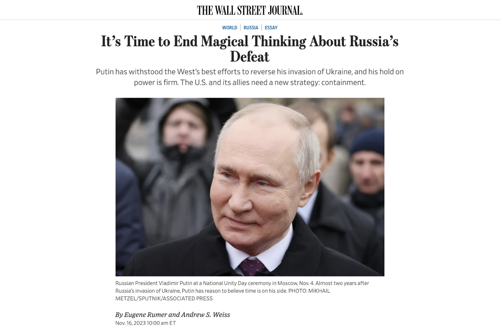

¡Uno a uno, los medios de comunicación van dando la espalda sin la menor vergüenza!

Aquí el WSJ [N. del T.: Wall Street Journal], con meses de retraso, se atreve a escribir que **¡ya es hora de acabar con el pensamiento mágico que afirma que Rusia está perdiendo la guerra!**

¡Ninguna vergüenza, ninguna excusa para un trabajo saboteado, podrido y engañoso publicado durante muchos meses!

Putin ha resistido los esfuerzos de Occidente para repeler la invasión y se aferra al poder con mano firme.

**Si se sabe elegir y se mantiene el espíritu crítico, el periodismo independiente de nuestros días es el único que merece la pena seguir. Su credibilidad es cada vez mayor, pero por supuesto hay que ser selectivo.**

